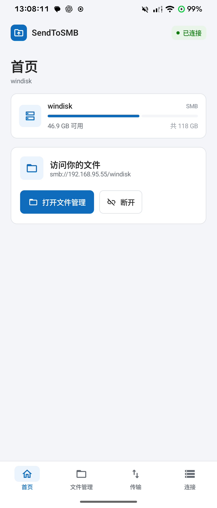
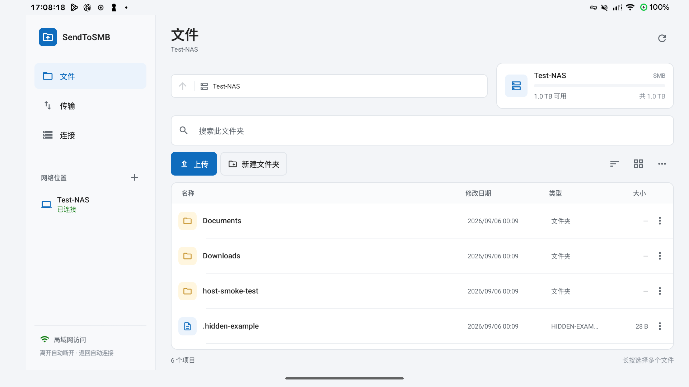

# SendToSMB 测试说明

## 已执行的验证（2026-10-09，1.3.0 / 6）

- 使用 JDK 17.0.20.1 执行 `assembleRelease`、`assembleDebug`、`assembleDebugAndroidTest`、`testDebugUnitTest` 和 `lintDebug`，全部成功；Lint 无错误。当前 Android Studio 捆绑 JBR 25 与工程现有 Kotlin / Gradle 版本不兼容，改为显式传入 JDK 17 构建，未调整依赖版本。
- 13 项 JVM 单元测试通过。新增 3 项速度测试覆盖小文件准备 / 切换耗时计入批量平均、停滞时实时速度归零、短任务与未知大小按实际传输字节计速。
- 新增后台传输仪器测试：开启后销毁 Activity 继续上传并核对 SHA-256，关闭后台选项后取消任务，通知取消停止队列。UI 测试增加后台复选框、连接后宣传文字、任务速度与顶栏平均速度断言，设置 / 加密历史测试增加后台开关和平均速度持久化。测试 APK 已编译通过；本次没有连接的手机，Android 15（API 35）模拟器因未安装硬件加速驱动无法启动，`-accel off` 软件模式以 `0xC0000005` 崩溃，因此这些设备测试未运行。
- `aapt2 dump badging` 确认发布 APK 包名 `com.zlight.sendtosmb`、版本 `1.3.0 / 6`、最低 API 26、目标 API 36，声明 dataSync 前台服务、通知、唤醒锁及 Wi-Fi 锁所需权限；Release APK 无 DEBUGGABLE 标记。
- 从 EasyUpdate 下载已发布的 1.2.0 APK 并与新包比较 `apksigner` 签名证书，SHA-256 均为 `383337cdc9552808990eb825a28c6c768bc4c479663fd04b71e67f409e2329ef`，保持覆盖升级的签名兼容性。
- 已通过 `scripts/Publish-EasyUpdate.ps1` 将 1.3.0 (6) 发布到 `http://192.168.95.55:19910`（应用 ID 6，后台 release ID 11）。公开接口对 `version_code=5` 返回更新，对 `version_code=6` 返回已是最新；服务端下载包、本地 Release APK 及接口校验值一致：`620aead9ce5e745c4b98a2e6d4b4a80a034709663e0c9d98b0ba15d75c3e2d79`，大小 16,026,899 字节。
- 本次未访问真实 SMB 文件内容，也未修改用户的 SMB 共享。设备仪器测试仅对 `127.0.0.1:1445/TESTSHARE` 的隔离目录执行写入。

复现新增后台传输验收：启动隔离 SMB 服务，连接 Android 设备并安装 Debug / AndroidTest APK，再运行：

```powershell
adb shell am instrument -w -e class com.zlight.sendtosmb.BackgroundTransferTest com.zlight.sendtosmb.test/androidx.test.runner.AndroidJUnitRunner
```

## 本机工具和设备

2026-09-06 检测到一台通过 USB 调试授权的测试机：型号 `23013RK75C` / `mondrian`，Android 16 (API 36)，物理分辨率 1440 × 3200，density 560。手机 Wi-Fi 已连接。

- Android SDK：`%LOCALAPPDATA%\Android\Sdk`
- ADB：`%LOCALAPPDATA%\Android\Sdk\platform-tools\adb.exe`
- JDK：`C:\Program Files\Android\Android Studio\jbr`，Java 21.0.10
- Gradle：8.13，工程 wrapper 或 `%USERPROFILE%\.gradle\wrapper\dists\gradle-8.13-bin` 缓存

环境检查未扫描局域网或调整防火墙。电脑有线网络与手机 Wi-Fi 处于不同 IPv4 子网，隔离集成测试使用 USB 转发；用户指定真实共享另做只读连接、目录和容量验证。

## 构建

```powershell
.\scripts\build.ps1
.\scripts\build.ps1 -Tasks 'assembleDebug', 'testDebugUnitTest', 'lintDebug'
.\scripts\build.ps1 -Tasks 'connectedDebugAndroidTest'
```

脚本默认构建 Debug APK 并执行单元测试。它为当前构建进程临时指定正常绝对路径的 Java Unix-domain socket 目录，并在退出时恢复环境变量。本机默认 `%TEMP%` 使用 `ZLIGHT~1` 形式的 8.3 路径，Java NIO `Selector.open()` 会因此报 `Unable to establish loopback connection / Invalid argument: connect`；只设置 IPv4 不能修复。`LoopbackProbe.java` 同时检查 TCP loopback 和 NIO selector。已使用此修复执行 Gradle `help --offline` 和生成 8.13 wrapper 成功。

## 隔离 SMB 服务

脚本使用 [Impacket 的 SimpleSMBServer](https://github.com/fortra/impacket/blob/master/examples/smbserver.py)，锁定测试依赖 `impacket==0.13.0`。仅监听电脑 `127.0.0.1:1445`，并通过 `adb reverse` 转发至手机。不修改系统 SMB、Windows 共享、445 端口或防火墙。服务只共享工程 `.testenv/share` 内生成的测试文件。所有测试环境文件应由 `.gitignore` 排除。

在工程目录的 PowerShell 执行：

```powershell
.\scripts\Start-TestSmb.ps1
# 如果多台设备同时连接，使用 -Serial 指定 adb devices 列出的设备。
```

首次运行会把 Python 依赖安装到 `.testenv/python-packages`。默认使用 Codex 随附 Python，也可传入 `-Python C:\path\to\python.exe`。脚本自动执行电脑端 SMB 验证：身份验证、创建目录、上传、下载 SHA-256 一致性、重命名、列目录、删除。

手机 App 内填写以下仅供测试的凭据：

| 设置 | 值 |
| --- | --- |
| URL | `smb://127.0.0.1:1445/TESTSHARE` |
| 用户名 | `android-test` |
| 密码 | `SendToSMB-test-only!` |
| 域 | 空 |

结束后执行：

```powershell
.\scripts\Stop-TestSmb.ps1
```

停止脚本核对 PID、启动时间和可执行路径后关闭本脚本服务，并仅移除它对应的 USB 端口转发。保留测试文件供核对，避免删除用户数据。

Windows 上 Python `os.open` 的句柄未启用 `FILE_SHARE_DELETE`，因此测试服务仅在 SMB rename 操作前关闭该测试文件句柄，操作后重新打开；此兼容处理只影响测试服务，不在 App 代码内。

Impacket 是协议测试服务器，`FILE_FS_FULL_SIZE_INFORMATION` 返回固定模拟容量（总量约 1.14 TB，可用量相同），不是电脑磁盘真实余量。脚本修正其将 SMB2 filesystem class 7 误当作 EA information 而仅返回 4 字节的问题，返回规范的 32 字节完整容量结构。真实共享的目录和容量已单独验证；SMB 3 加密、服务器配额和其他 NAS 的兼容性不在此次覆盖范围内。

## 验收清单

- [x] 无连接配置时显示引导；自定义 URL 支持服务器、端口、共享名和初始子目录。
- [x] 保存配置后能连接共享并显示容量；未知容量显示占位，不能显示为 0 容量。
- [x] 列表展示文件夹、文件大小、修改时间；支持面包屑、搜索、排序、刷新。
- [x] 中文名、空格文件名、零字节文件显示与传输正确。
- [x] 通过 Android 文件选择器上传，下载使用 Android 授权位置，文件校验和一致。
- [x] 新建目录、重命名、递归复制/移动/删除协议测试通过，界面删除确认可取消。
- [x] 退出或进入后台后断开，重新进入后使用保存的凭据重新连接。
- [x] Wi-Fi 不可用状态显示非阻塞提示，并发出系统 Wi-Fi 设置操作；未检测到局域网时也可直接尝试连接（Compose UI 测试，未关闭用户手机网络）。
- [x] 设置页提供 E Ink 模式开关，开启后全应用灰度渲染；开关持久化（Compose UI 与仪器测试）。
- [x] 设置页提供 EasyUpdate 地址输入与检查更新动作；地址规范化、更新包 SHA-256/包名/版本校验逻辑由单元测试覆盖；`http://192.168.95.55:19910` 公开接口连通性已确认。
- [x] 手机 21:9 窄屏可滚动操作；平板 16:9 横屏采用侧栏与文件内容的双栏布局。
- [x] 错误密码被拒绝；无响应服务器连接可被断开及时中止，后续重连正常。

平板布局优先通过专用模拟器、Compose 预览或测试环境验证。使用测试机调整显示设置后，恢复它原本的分辨率与密度。

## 已执行的验证（2026-09-09）

- `assembleDebug`、`assembleDebugAndroidTest`、`testDebugUnitTest` 和 `lintDebug` 成功；Lint 无错误，保留依赖版本和代码风格建议。
- 8 个 JVM 地址解析单元测试通过。
- Redmi Android 16 上完整仪器测试通过：文件树往返、SHA-256、零字节、取消不发布部分文件、错误密码与重连、无响应连接的强制断开、容量、真实共享只读、凭据/传输历史/默认下载目录加密、ViewModel 生命周期、独立首页/文件管理、搜索/网格/删除确认和再次下载。Runner 显示 `OK (14 tests)`，其中 1 个是未传参而跳过的手工配置辅助测试。
- 真实 `smb://192.168.95.55/windisk` 在手机上使用访客认证读取成功：82 个根目录项目，总容量 126,495,985,664 字节，可用 50,355,122,176 字节（当时的读取结果）。另对用户截图中的 `202609计算机三级linux应用与开发` 连续执行 5 次目录读取，验证点击目录时不会复用已关闭的共享。整个真实共享测试函数只有连接、list、capacity 和 disconnect，无写入/删除调用。
- 系统文件选择器实测上传 `SendToSMB-upload-check.txt` 到隔离共享成功，SHA-256：`76AC51CD9DF0521D6DDFBFB0B20063AE4D972455820082529964A4937C16CF06`，与手机上传前的测试源一致。
- 通过文件菜单下载同一文件，系统目录选择器授权 `Documents/SendToSMB-check` 后保存成功；下载后的 SHA-256 与上述源文件完全一致。
- 使用同一测试机临时模拟 1080×2520、420dpi 的 21:9 手机，以及 1920×1080、240dpi 的 16:9 平板横屏；两种布局各 3 个 UI 测试通过，并实际查看截图。验证首页、独立文件管理、搜索、传输历史和四栏导航在两种比例下均可操作。
- 检查结束后恢复原始 1440×3200、560dpi、旋转 0、自动旋转关闭的设置。实际平板硬件尚未测试；布局通过手机显示尺寸模拟验证。
- 已移除手机里的隔离测试连接配置，保留用户的 Windisk 连接。回到桌面后重新打开应用，真实共享自动重连成功，界面显示 82 个项目及真实容量。
- 已复现导致偶发失败的 `DiskShare has already been closed`，连接状态现在同时检查 SMBJ 共享和底层 Socket；目录读取会丢弃关闭的共享并自动重连一次。下载文件在服务端拒绝读取属性时回退到仅请求 `FILE_READ_DATA`。真实共享回归仍只调用连接、目录、容量和断开，不包含任何写入或删除。

SMBJ 0.14.0 的匿名 SMB3 登录遇到上游 #872 空 session key 问题，应用对空凭据使用 `AuthenticationContext.guest()`，真实共享只读回归已通过。Android 16 UI 自动化需要 Espresso 3.7.0，已显式锁定以避免旧版反射 `InputManager.getInstance()` 的失败。

## 已执行的验证（2026-10-05）

- `assembleDebug`、`assembleDebugAndroidTest`、`testDebugUnitTest` 和 `lintDebug` 成功；Lint 无错误，保留依赖版本和代码风格建议。构建版本提升为 `1.2.0 / 5`。
- JVM 单元测试 10 个通过；新增 `EasyUpdateClientTest` 覆盖 EasyUpdate 服务地址规范化（去空格、去末尾斜杠、保留路径）与空串、缺协议、ftp、带凭据/查询/片段等非法地址的拒绝。
- 在 Redmi Android 16 测试机（序列号 `b5b85793`）运行仪器测试：16 个测试中 11 个通过，包括新增的设置页 E Ink 开关/EasyUpdate 检查动作 UI 测试与设置持久化测试，以及既有凭据加密、传输历史、生命周期辅助、搜索/网格/下载历史等用例。
- 5 个依赖 `smb://127.0.0.1:1445/TESTSHARE` 隔离服务的用例未能通过：本机 adb 服务位于 `127.0.0.1:5039` 的 SSH 隧道另一端，`adb reverse tcp:1445` 指向隧道对端而不是运行 Python 测试服务的电脑；测试机 Wi-Fi 为 `192.168.3.0/24`，与本机测试网段 `192.168.95.0/24` 不同，手机也未持有 USB 转发。失败均为 SMB2 negotiate 阶段的 EOF，属环境拓扑限制，与本次代码改动无关；隔离服务在本机通过认证、创建、上传、下载 SHA-256、重命名、列表、删除烟测。
- 设备安装的 1.2.0 Debug APK 经 `aapt2 dump badging` 核对：包名 `com.zlight.sendtosmb`，`versionCode=5`，`versionName=1.2.0`，包含 `REQUEST_INSTALL_PACKAGES` 与 `FileProvider`。
- EasyUpdate 服务 `http://192.168.95.55:19910` 从本机可访问：`GET /api/v1/announcements` 返回 200；`GET /api/v1/apps/com.zlight.sendtosmb/latest` 返回 404 `app_not_found`，说明客户端接入路径正确，待服务端注册应用并发布版本后即可在线检查更新。服务端后台使用 `admin/admin` 登录，公开 API 无需认证。
- 本次未执行真实共享 `smb://192.168.95.55/windisk` 的只读回归，也未在服务端上传或发布 APK。

## 已执行的验证（2026-10-06）

- 按所有者选择，`release` 构建类型使用本机 Android 调试密钥签名（`app/build.gradle.kts` 中已注释说明对外发行需替换）。`assembleRelease` 成功，产物保存为 `releases/SendToSMB-1.2.0.apk`（16,009,731 字节）；`aapt2 dump badging` 核对包名 `com.zlight.sendtosmb`、`versionCode=5`、`versionName=1.2.0` 且非 debuggable，`apksigner` 确认为 Android Debug 证书。`assembleDebug`、`testDebugUnitTest`、`assembleDebugAndroidTest` 与 `lintDebug` 同时通过。
- 设置页按反馈删除全部说明性文案，仅保留标题、控件和状态信息：页码副标题“显示与更新”、E Ink 描述、EasyUpdate 描述、地址帮助文字与“安装前校验 SHA-256”说明均已移除。
- 已通过 `scripts/Publish-EasyUpdate.ps1` 在 `http://192.168.95.55:19910` 后台注册应用「SendToSMB」（ID 6），发布版本 `1.2.0 (5)`（release ID 9）。设置页调整后使用脚本的 `-Replace` 选项删除旧发布，并以同一版本号重新上传、发布。
- 公开 API 对 `version_code=4` 返回 `update_available: true` 及正确的 `download_url`、`size`、`sha256`，对 `version_code=5` 返回 `update_available: false`；服务端下载、本机构建与测试机已安装 `base.apk` 三方 SHA-256 均为 `ae761e6d0f6cb8e0ae85b650e7bdb91d77794147c885d18632586c5528e7b9ba`。
- 测试机 `b5b85793` 已完成覆盖安装（与调试版签名相同，应用数据保留）：`dumpsys package` 显示 `versionCode=5`、`versionName=1.2.0`、无 DEBUGGABLE 标记；应用启动正常，设置页检查更新显示「已是最新版本（1.2.0 · 5）」；E Ink 开关开启后全界面变为灰度，验证后已关闭。

手工复现仪器测试（先运行隔离服务）：

```powershell
adb install -r app/build/outputs/apk/debug/app-debug.apk
adb install -r app/build/outputs/apk/androidTest/debug/app-debug-androidTest.apk
adb shell am instrument -w -r -e realSmbUrl smb://192.168.95.55/windisk -e realSmbPath 202609计算机三级linux应用与开发 com.zlight.sendtosmb.test/androidx.test.runner.AndroidJUnitRunner
```

省略 `realSmbUrl` 即跳过真实共享检查。`DeviceSetupTest` 仅在显式传入 `setupUrl` 时写入本地加密连接配置，供手工 UI 验证，不会访问共享。

布局验证可运行 `scripts/Check-Layouts.ps1`，它在 `finally` 中恢复显示设置；需先安装应用和测试 APK，解锁手机。截图和详细运行日志写入忽略提交的 `.testenv`。

## 界面截图

以下为测试机上只读连接真实共享后的首页，仅显示连接名称、地址和容量，不包含共享中的文件名。




